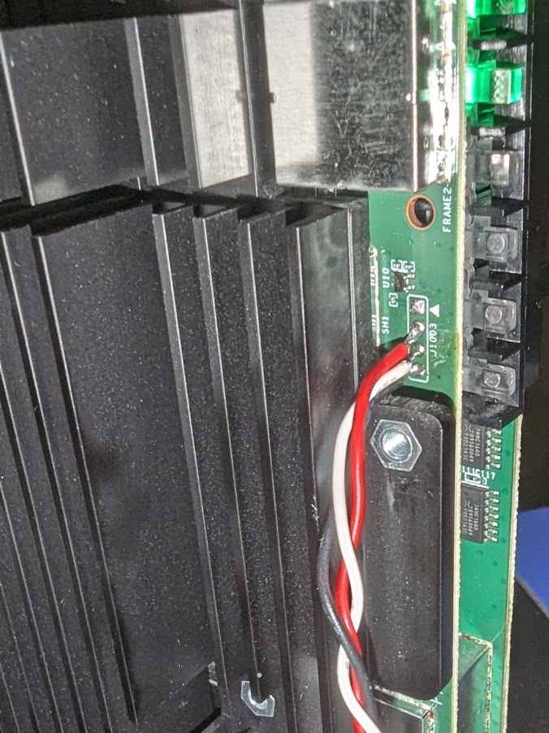
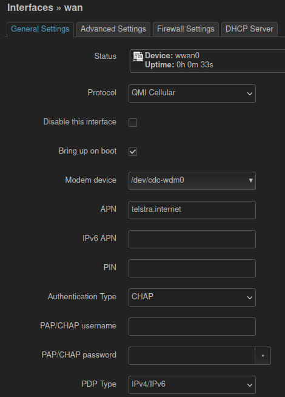

# The hardware I started with
```
System Information
Model Name: 	AW1000
Firmware Version: 	0.06.01r (Patched to disable easy root access :( )
Hardware Version: 	XCI35AX44Z-TA
``````

Defaults:
* IP is 192.168.0.1
* user=admin
* password=Telstra

Im with Telstra, but the default AW1000 blocks data sims (you need a Broadband SIM instead). Im guessing that this can be bypassed with a SIM unlock, but that is not an option for ```0.06.01r``` firmware as the UART prompt doesn't allow you to drop to the kernel.

The next step is to try OpenWRT (spoiler alert - it works!)

# Getting root
https://forums.whirlpool.net.au/thread/9qr1j570

Note: none of this works with 0.06.01r firmware, so we need to go another route: UART aka the debricking route.

# OpenWRT support for AW1000

https://github.com/openwrt/openwrt/commit/fbcda3616e2c18b533a552fad9b724a636bcae5e
``````
ipq807x: add Arcadyan AW1000 support

Hardware specification:
  SoC: Qualcomm IPQ8072A
  Flash: Toshiba NAND 1GiB
  RAM: 1 GiB of DDR3 466 MHz
  Ethernet: 4x 1Gbps + 1x 2.5Gbps
  WiFi1: QCN5024 2.4GHz ax 4x4
  WiFi2: QCN5054 5GHz ax 4x4
  Button: WiFi, WPS, Reset
  Modem: RG500Q-EA
  USB: 1 x USB 3.0
  Power: DC 12V 4A

Flash instructions:
  1. Download the initramfs image, rename it to
     initramfs.bin, and host it with tftp server.
  2. Interrupt U-Boot and run these commands:
     tftpboot initramfs.bin
     bootm
  3. After openwrt boots up, use scp or luci web
     to upload sysupgrade.bin to upgrade.

Signed-off-by: Chukun Pan <amadeus@jmu.edu.cn>
Reviewed-by: Robert Marko <robimarko@gmail.com>
``````

# Instructions from OpenWRT
https://openwrt.org/toh/arcadyan/astoria/aw1000

As per the instructions, the UART pinout from top to bottom is:
* VCC (square pad)
* TX
* RX
* GND

There is not a lot of room there for soldering proper header pins, so I recommend you soldering a long cable to it (like I did).

This is what the J1003 UART looks like, it is missing from the instructions<br>


## Get the firmware

### Create the share directory
First of all, we create the share directory on our PC so that we can host the binaries for the AW1000
```
sudo mkdir -p /data/tftp
sudo chown -R nobody:nogroup /data/tftp
sudo chmod -R 777 /data/tftp
```

Then go to the firmware selector
https://firmware-selector.openwrt.org/?version=SNAPSHOT&target=qualcommax%2Fipq807x&id=arcadyan_aw1000

As of writing this (August 2024) the OpenWRT snapshot is ```r27076-d604b2699b``` which is > ```23.05.4```.

First of all, grab the initramfs ```wget -nc https://downloads.openwrt.org/snapshots/targets/qualcommax/ipq807x/openwrt-qualcommax-ipq807x-arcadyan_aw1000-initramfs-uImage.itb```. Copy and rename the initramfs to initramfs.bin ```cp openwrt-*.itb /data/tftp/initramfs.bin```.

Click the ```Customize installed packages and/or first boot script``` toggle as LuCI (the web interface) is not included in snapshots.

Once you add LuCI you need to perform a "Request Build" and download those binary products. While you are creating a custom build I would recommend the following additional packages:
```
 ca-certificates coreutils-sort curl gawk htop iperf3 irqbalance luci luci-app-adblock luci-app-firewall luci-app-https-dns-proxy luci-app-openvpn luci-app-opkg luci-app-sqm luci-app-statistics luci-proto-qmi luci-proto-mbim luci-proto-modemmanager luci-proto-wireguard luci-ssl openvpn-mbedtls tcpdump-mini
```
After you have made your selections, click ```Request Build``` and download the ```factory``` and ```sysupgrade``` packages.

The overall list of selections (including defaults) are:
```
ath11k-firmware-ipq8074 base-files busybox ca-bundle ca-certificates coreutils-sort curl dnsmasq dropbear e2fsprogs firewall4 fstools gawk htop iperf3 irqbalance ipq-wifi-arcadyan_aw1000 kmod-ath11k-ahb kmod-fs-ext4 kmod-gpio-button-hotplug kmod-gpio-nxp-74hc164 kmod-leds-gpio kmod-nft-offload kmod-phy-aquantia kmod-qca-nss-dp kmod-spi-gpio kmod-usb-dwc3 kmod-usb-dwc3-qcom kmod-usb-serial-option kmod-usb3 libc libgcc libustream-mbedtls logd losetup luci luci-app-adblock luci-app-firewall luci-app-https-dns-proxy luci-app-openvpn luci-app-opkg luci-app-sqm luci-app-statistics luci-proto-qmi luci-proto-mbim luci-proto-modemmanager luci-proto-wireguard luci-ssl mtd netifd nftables odhcp6c odhcpd-ipv6only openvpn-mbedtls opkg ppp ppp-mod-pppoe procd procd-seccomp procd-ujail tcpdump-mini uboot-envtools uci uclient-fetch uqmi urandom-seed urngd wpad-basic-mbedtls
```
These files are included in the ```binary``` folder (naughty me, storing binaries in git!)

Then we copy these to the tftp share directory
```
cp binary/openwrt-d8b667838c87*.ubi /data/tftp/factory.ubi
cp binary/openwrt-d8b667838c87*.bin /data/tftp/sysupgrade.bin
```

## QWRT - an alternative to OpenWRT
QWRT is a really neat mod on the stock OpenWRT.

As of writing this, the latest QWRT build from @Hikari is v1.1.0b (https://github.com/xhikarishii/openwrt-ipq/releases/tag/v1.1.0b), released 2024-07-12.
The ```sysupgrade.bin``` is as an alternative you can flash once you have flashed the ```factory.ubi``` from OpenWRT. Once again, I have included it in the binary folder like a naughty person.

To download it
```
pushd binary
wget -nc https://github.com/xhikarishii/openwrt-ipq/releases/download/v1.1.0b/hikariwrt-v1.1.0b-11072024-qualcommax-ipq807x-arcadyan_aw1000-squashfs-sysupgrade.bin
popd
```

The v1.1.0b release contains the ```initramfs```, ```factory.ubi```, and ```sysupgrade.bin``` so you can use these files in place of the OpenWRT files downloaded from the custom snapshot build above.

## Setup the TFTP server
```
sudo apt update
sudo apt install tftpd-hpa
```

check that the service is running
```
sudo systemctl status tftpd-hpa.service
```
start it automatically at boot
```
sudo systemctl enable tftpd-hpa
```
modify the setup

```sudo nano /etc/default/tftpd-hpa```
and change:
1. The directory to e.g. /data/tftp
```TFTP_DIRECTORY="/data/tftp"```
2. The address to ```0.0.0.0:69``` to accept connections from any client on port 69 ```TFTP_ADDRESS="0.0.0.0:69"```


Restart the server to accept these changes
```sudo systemctl restart tftpd-hpa```

## Test the TFTP server
Install the client ```sudo apt install tftp-hpa```
Connect to the TFTP server ```tftp 192.168.100.160```
Check the tftp server status ```tftp> status```
To download a file from the tftp server ```tftp> get tecmint.info```
To upload a file to the tftp server ```tftp> put tecmint.txt```

## TFTP boot
1. Set your PC’s Ip address to 192.168.1.10 and connect it to your router on port 1 of the yellow ports.
2. Download the initramfs image, rename it to initramfs.bin, and host it with tftp server.
3. Connect to your router via Serial using the usb to uart/ttl adapter (serial parameters: 115200 8N1)
4. In your serial software, press Esc-key to interrupt U-Boot while turning on the router and run these commands:
```
setenv serverip 192.168.1.10
setenv ipaddr 192.168.1.1
tftpboot initramfs.bin
bootm
```
5. Continue with ubiformat or sysupgrade.

## Ubiformat: Coming from Telstra stock firmware
```
scp factory.ubi root@192.168.1.1:/tmp/factory.ubi
ssh root@192.168.1.1
ubiformat /dev/mtd18 -y -f /tmp/factory.ubi
```

## Sysupgrade: Coming from an OpenWRT firmware
Note: Normally you would perform an upgrade using the LuCI interface

```
scp sysupgrade.bin root@192.168.1.1:/tmp/sysupgrade.bin
ssh root@192.168.1.1
sysupgrade -n /tmp/sysupgrade.bin
```

## wan settings (from network->interfaces)
1. delete wan6 (recommended: removes dhcpv6/ipv6 support)
2. select "QMI Cellular" as the protocol (ModemManager didn't work for the SIM)
3. APN = telstra.internet
4. Authentication = CHAP
5. PDP Type = IPv4/IPv6

It should look like this <br>

